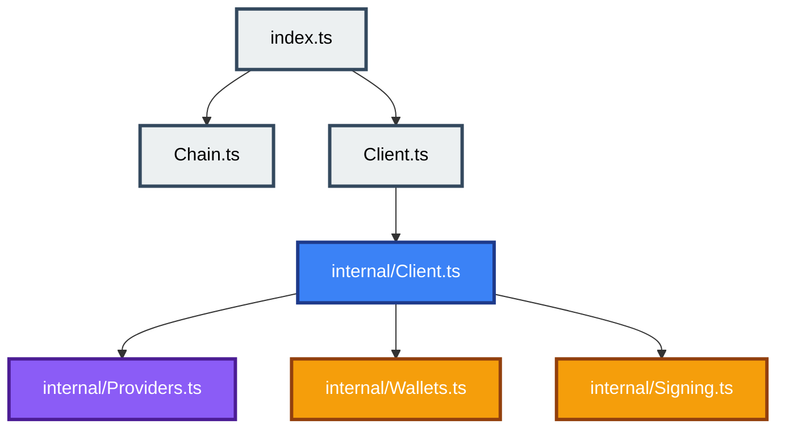

# Client Module Minimal Effect Layout

## Abstract

This document specifies a minimal, Effect-inspired module layout for the SDK client package. It defines a flat public surface for client concepts, an `internal/` implementation boundary, and a focused split of signing logic from wallet construction logic.

## Purpose and Scope

This specification covers the source layout and module responsibilities for the client package under `packages/evolution/src/sdk/client/`. It defines what the public modules export, what moves into `internal/`, and how the existing staged client behavior is preserved. It does not change public runtime behavior, stage semantics, or provider and wallet capability ordering.

## Introduction

The current client package exposes a flat public API but keeps the main implementation split across a public `ClientImpl` module and a large internal wallet helper module. The chosen layout moves the constructor implementation behind the public `Client` module and extracts signing-heavy logic from wallet construction logic.

Public modules remain concept-oriented. Implementation modules remain hidden behind `internal/` and are not part of the supported import surface.

## Functional Specification (Normative)

### 1. Layout and visibility

The client package SHALL use the following layout:

- `index.ts`
- `Chain.ts`
- `Client.ts`
- `internal/Client.ts`
- `internal/Providers.ts`
- `internal/Wallets.ts`
- `internal/Signing.ts`

The following MUST hold:

- `index.ts` MUST remain the single module-level barrel for the client package.
- `Chain.ts` MUST expose chain types and presets only.
- `Client.ts` MUST expose public client types, public configuration types, and the `client` constructor.
- `internal/Client.ts` MUST own stage assembly and runtime composition.
- `internal/Providers.ts` MUST own provider runtime construction only.
- `internal/Wallets.ts` MUST own wallet runtime construction and read-only address validation only.
- `internal/Signing.ts` MUST own signing-specific algorithms and signing effect composition.

### 2. Public surface

The public client surface MUST remain flat.

The following MUST hold:

- Consumers MUST be able to import client concepts from `sdk/client/index` and package root exports without referencing `internal/`.
- The public `Client.ts` module MUST forward the `client` constructor from `internal/Client.ts`.
- Public stage types and configuration types MUST remain declared in `Client.ts`.
- Public source files MUST NOT expose internal helper modules as public reference pages.

### 3. Internal responsibility split

The following responsibilities MUST be separated:

- Address decoding and reward-address validation belong to `internal/Wallets.ts`.
- Mnemonic, private-key, and CIP-30 wallet construction belong to `internal/Wallets.ts`.
- Required-signer discovery and signing-wallet witness construction belong to `internal/Signing.ts`.
- Provider-backed signing augmentation, including reference input auto-fetch for signing clients, belongs to `internal/Signing.ts`.
- Stage transitions and client object assembly belong to `internal/Client.ts`.

### 4. Compatibility

The refactor defined by this specification MUST preserve:

- all current public client type names
- all current public capability method names
- current chain-scoped staged assembly semantics
- current Promise and Effect dual interface behavior
- current provider and wallet error categories

The refactor SHOULD remove the public `ClientImpl` module from the primary export surface.

### Examples (Informative)

Example 1: `Client.ts` declares `ClientAssembly`, `ReadClient`, `SigningClient`, and forwards `client` from `internal/Client.ts`.

Example 2: `internal/Wallets.ts` constructs read-only, seed, private-key, and CIP-30 wallets but delegates signing algorithms to `internal/Signing.ts`.

## Appendix

### Appendix A: Rationale and Alternatives (Informative)

This layout is chosen because it is closer to Effect's public-module-over-internal-implementation style than a nested feature-folder or public multi-barrel layout. A smaller three-internal-file option was considered, but the signing logic is large enough that keeping it inside `Wallets.ts` would preserve the current density problem.

### Appendix B: Glossary (Informative)

- Flat public surface: a public API where consumers import concept modules rather than implementation folders
- Internal boundary: a directory whose modules are used by public facades but are not part of the supported consumer import contract
- Stage assembly: the runtime composition that upgrades client capability stages without mutating prior stages