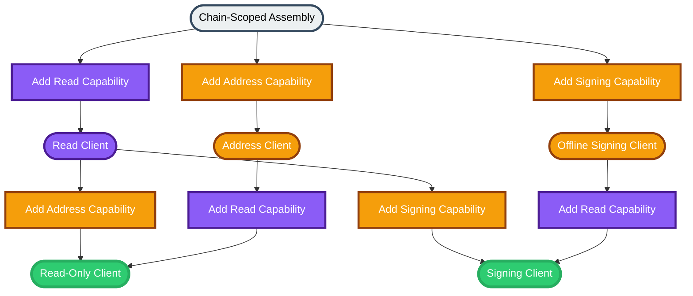

# Evolution SDK Client Capability Assembly Specification

## Abstract

This document specifies the Evolution SDK client architecture as a chain-scoped capability assembly model. It defines the public stages, legal transitions between stages, capability ordering rules, execution boundaries, and error semantics. The specification replaces the older attach-based model in which provider and wallet objects were primary public composition units.

## Purpose and Scope

This specification defines how applications construct executable SDK clients from chain context and named capability additions. It covers stage semantics, immutable upgrade rules, operation availability, transaction building constraints, and the Effect-Promise execution contract. It does not define provider-specific protocols, browser wallet standards, or internal implementation details. Provider failover remains defined by the [Provider Failover specification](./provider-failover.md). Dual-interface execution semantics remain defined by the [Effect-Promise Architecture specification](./effect-promise-architecture.md).

## Introduction

The Evolution SDK exposes a client-centric assembly flow. Construction begins from chain context. Read capability, address capability, and signing capability are then added through flat, named capability operations. Each addition returns a new stage with a larger executable surface. Provider and wallet implementations exist to satisfy these capabilities but are not the primary public composition model.

The stages are:
- Chain-Scoped Assembly: chain metadata and capability addition only; not executable
- Read Client: provider-backed read and submission operations
- Address Client: address and reward-address operations only
- Offline Signing Client: address and signing operations only
- Read-Only Client: read capability plus address capability
- Signing Client: read capability plus signing capability

## Functional Specification (Normative)

Requirements language: The key words MUST, MUST NOT, SHOULD, SHOULD NOT, and MAY are to be interpreted as described in RFC 2119 and RFC 8174 when, and only when, they appear in all capitals.

### 1. Public construction model

1. The public entrypoint MUST begin from explicit chain context.
2. The initial returned stage MUST represent assembly, not execution.
3. The initial returned stage MUST expose chain metadata and named capability-addition operations only.
4. The initial returned stage MUST NOT expose provider queries, wallet operations, transaction building, submission, or a generic execution namespace.
5. The public API MUST use flat, named capability operations for concrete capability kinds.
6. The public API MUST NOT require callers to construct standalone provider runtime objects or standalone wallet runtime objects in order to assemble a client.
7. Generic attachment operations that accept arbitrary provider or wallet objects MUST NOT be part of the primary public composition surface.

### 2. Capability kinds

The public composition model defines three capability kinds:
- Read Capability: blockchain queries, protocol parameters, transaction evaluation, confirmation waiting, and submission where supported
- Address Capability: payment address and reward address resolution without signing
- Signing Capability: address resolution plus transaction signing and message signing; submission MAY be available when the signing source natively supports submission

The following MUST hold:
- Signing Capability MUST subsume Address Capability.
- Address Capability MUST NOT subsume Signing Capability.
- Read Capability MUST be independent of Address Capability and Signing Capability.
- Transaction building MUST require Read Capability.

### 3. Stage conformance

An executable client instance conforms to exactly one of the following executable stages:
- Read Client
- Address Client
- Offline Signing Client
- Read-Only Client
- Signing Client

The following MUST hold for each stage:
- Read Client MUST expose read operations and transaction submission where the configured read capability supports submission.
- Read Client MUST NOT expose address-scoped convenience operations or signing operations.
- Address Client MUST expose payment address and reward address resolution.
- Address Client MUST NOT expose signing, read operations, transaction building, or submission.
- Offline Signing Client MUST expose payment address and reward address resolution together with transaction signing and message signing.
- Offline Signing Client MUST NOT expose read operations or transaction building.
- Read-Only Client MUST expose read operations, payment address and reward address resolution, and address-scoped convenience queries.
- Read-Only Client MUST NOT expose signing.
- Signing Client MUST expose read operations, payment address and reward address resolution, address-scoped convenience queries, transaction building, signing, and submission.

### 4. Legal transitions and ordering

The public API MUST support the following stage transitions:
- Chain-Scoped Assembly to Read Client
- Chain-Scoped Assembly to Address Client
- Chain-Scoped Assembly to Offline Signing Client
- Read Client to Read-Only Client
- Read Client to Signing Client
- Address Client to Read-Only Client
- Offline Signing Client to Signing Client

The following MUST also hold:
- Adding Read Capability and then Signing Capability MUST produce the same final stage semantics as adding Signing Capability and then Read Capability.
- Adding Read Capability and then Address Capability MUST produce the same final stage semantics as adding Address Capability and then Read Capability.
- A stage that already contains Signing Capability MUST NOT accept an additional Address Capability.
- A stage that already contains Read Capability MUST NOT accept a second Read Capability.
- A stage that already contains Signing Capability MUST NOT accept a second Signing Capability.
- A stage that already contains Address Capability MUST NOT accept a second Address Capability.
- Capability addition MUST be immutable: each addition returns a new stage and MUST NOT mutate a previously returned stage.

### 5. Operation availability

The following availability rules are normative:
- Read operations MUST only be available on stages with Read Capability.
- Address resolution MUST only be available on stages with Address Capability or Signing Capability.
- Transaction signing and message signing MUST only be available on stages with Signing Capability.
- Address-scoped convenience queries, including wallet UTxO lookup and wallet delegation lookup, MUST only be available on stages that contain both Read Capability and address resolution.
- Transaction building MUST only be available on stages with Read Capability.
- Read-Only transaction building MUST produce an unsigned transaction result.
- Signing transaction building MUST produce a result that can continue into signing and submission.

### 6. Input treatment and implementation hiding

The public API MAY accept configuration data or external API handles as inputs to named capability operations.

The following MUST hold:
- Read-capability operations MUST accept provider-specific configuration data and internally construct the required runtime implementation.
- Address-capability operations MUST accept address data and optional reward-address data and internally construct the required runtime implementation.
- Signing-capability operations MUST accept signing-source configuration data or external wallet API handles and internally construct the required runtime implementation.
- Provider runtime implementations and wallet runtime implementations MUST be treated as internal capability backends rather than primary public assembly objects.

### 7. Chain semantics and validation

Chain context is the root configuration for all stages.

The following MUST hold:
- Chain context MUST be available to every stage produced from the same assembly root.
- Capability implementations MUST validate network-sensitive inputs against chain context.
- Address capability and signing capability MUST fail when resolved address data conflicts with the configured chain.
- Reward-address resolution MUST fail when the resolved reward address conflicts with the configured chain.

### 8. Error model and execution semantics

The following MUST hold:
- External read failures MUST surface as provider-classified failures.
- Address and signing failures MUST surface as wallet-classified failures.
- Transaction-building validation failures MUST surface as builder-classified failures.
- Order-independent stage composition MUST preserve the same success values and error classes for equivalent final stages.
- Every executable stage method with Promise semantics MUST have an equivalent Effect program with identical success values and error categories.
- Assembly-stage operations MUST remain side-effect free until an executable method is interpreted or awaited.

### 9. Compatibility and removal

The attach-based role model is removed by this specification.

The following MUST hold:
- The primary public API MUST NOT expose generic provider-attachment operations.
- The primary public API MUST NOT expose generic wallet-attachment operations.
- Public examples, guides, and tests MUST describe client construction in terms of chain-scoped assembly and named capability operations.
- Legacy role names centered on provider-only and wallet-only composition SHOULD be removed from user-facing documentation unless required for migration notes.

### Examples (Informative)

Example 1: An application starts from chain context, adds a read capability backed by an HTTP service, and then adds a mnemonic-based signing capability. The resulting stage can build, sign, and submit transactions.

Example 2: An application starts from chain context, adds address capability for a watched account, and later adds read capability. The resulting stage can resolve the watched account, query its UTxOs, and inspect delegation state, but cannot sign.

Example 3: An application starts from chain context, adds browser-wallet signing capability, and later adds read capability. The resulting stage can build transactions from chain data and sign them through the external wallet.

## Appendix

### Appendix A: Rationale and Alternatives (Informative)

This specification replaces the older attach-based model for three reasons:
- It makes chain context the clear root of all capability resolution.
- It makes capability growth explicit without elevating provider and wallet runtimes into primary public concepts.
- It keeps the public surface flat and intention-revealing.

The primary alternative was to preserve generic attachment operations and merely rename the stages. That approach was rejected because it continued to center public composition on provider and wallet objects rather than on client capability assembly.

### Appendix B: Glossary (Informative)

- Chain-Scoped Assembly: the initial non-executable stage from which capability additions begin
- Read Capability: the capability that provides chain queries, transaction evaluation, and submission where supported
- Address Capability: the capability that provides payment-address and reward-address resolution without signing
- Signing Capability: the capability that provides address resolution plus transaction and message signing
- Executable Stage: a stage that exposes Promise and Effect operations rather than capability addition only
- Final Stage: a stage that contains all capabilities required for a target application workflow
