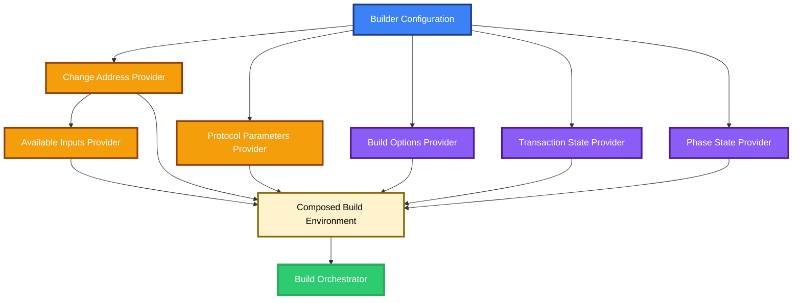

# TxBuilder Internal Layer Composition Specification

**Version**: 1.0.0  
**Status**: DRAFT  
**Created**: April 7, 2026  
**Authors**: Evolution SDK Team  
**Reviewers**: [To be assigned]

---

## Abstract

This specification defines the internal reorganization of the transaction builder around a thin public facade and a composed service environment. The design preserves the existing fluent builder contract, build semantics, and Promise and Effect entry points while replacing ad hoc dependency provisioning with explicit, build-scoped service composition. The specification establishes module boundaries, service lifetime rules, dependency resolution requirements, and execution constraints for the chosen internal architecture.

---

## Purpose and Scope

This specification defines the required internal architecture for the transaction builder after selecting the layer-composition refactor path.

**Purpose**: Reduce structural coupling inside the transaction builder, replace manual service injection chains with declarative service composition, and preserve the current external behavior of transaction construction.

**Scope**: This specification covers public contract preservation, internal module decomposition, build-scoped service construction, dependency ordering, execution flow, error propagation, and internal testing seams for the transaction builder.

**Out of Scope**: This specification does not redefine transaction-building algorithms, change the fluent builder API, alter the phase state machine contract, modify the semantics of queued programs, or introduce new user-facing capabilities.

---

## Introduction

The current transaction builder concentrates public exports, runtime state, dependency resolution, build orchestration, and phase control inside a single large module. That arrangement makes the code difficult to navigate and increases the cost of isolated changes. The selected architecture addresses the problem by separating public surface from internal mechanics and by expressing runtime dependencies as a composed service environment instead of a manual sequence of injections.

The design preserves the existing builder style. Builder methods continue to accumulate transaction intent in the same order, build execution continues to interpret the accumulated program list before phase execution, and final assembly continues to produce the same result types and error behavior. The change is internal organization and dependency composition, not product behavior.

### Architectural Overview

```mermaid
graph TD
    Facade[Public Builder Facade<br/>[1] Re-exports public contracts<br/>[2] Delegates construction] --> Factory[Builder Factory<br/>[3] Owns queued program list]
    Factory --> Build[Build Orchestrator<br/>[4] Executes queued programs<br/>[5] Runs phase workflow]
    Build --> Services{Composed Service Environment<br/>[6] Build-scoped providers}
    Build --> Phases[Phase Executors<br/>[7] Existing phase semantics]
    Build --> Assembly[Final Assembly<br/>[8] Produces final result]
    Services --> Context[Mutable Build Context<br/>[9] Transaction state ref]
    Services --> Runtime[Resolved Runtime Inputs<br/>[10] Protocol parameters<br/>[11] Change address<br/>[12] Available inputs]
    Phases --> Context
    Assembly --> Context

    style Facade   fill:#3b82f6,stroke:#1e3a8a,stroke-width:3px,color:#ffffff
    style Factory  fill:#3b82f6,stroke:#1e3a8a,stroke-width:3px,color:#ffffff
    style Build    fill:#ecf0f1,stroke:#34495e,stroke-width:3px,color:#000000
    style Services fill:#fff3cd,stroke:#856404,stroke-width:3px,color:#000000
    style Phases   fill:#ecf0f1,stroke:#34495e,stroke-width:3px,color:#000000
    style Assembly fill:#2ecc71,stroke:#27ae60,stroke-width:4px,color:#ffffff
    style Context  fill:#8b5cf6,stroke:#4c1d95,stroke-width:3px,color:#ffffff
    style Runtime  fill:#f59e0b,stroke:#92400e,stroke-width:3px,color:#ffffff
```

References:

- [1] The facade is the only public module boundary for the builder package.
- [2] Public exports remain stable and complete.
- [3] Builder construction remains responsible for intent accumulation.
- [4] Queued program execution remains the first build step after environment setup.
- [5] Existing phase progression remains intact in this architecture.
- [6] Service construction is explicit, declarative, and build-scoped.
- [7] Phase modules retain their current behavioral responsibilities.
- [8] Final assembly determines the final return shape exactly as today.
- [9] Mutable transaction state remains scoped to a single build invocation.
- [10] Protocol parameters are resolved once per build.
- [11] Change address is resolved once per build.
- [12] Available inputs are resolved once per build after prerequisites are available.

---

## Functional Specification (Normative)

The key words MUST, MUST NOT, SHOULD, SHOULD NOT, and MAY in this document are to be interpreted as described in RFC 2119.

### Public Contract Preservation (Normative)

1. The transaction builder MUST preserve the existing fluent builder API, including method names, chaining behavior, result categories, and execution timing.
2. Public Promise-returning entry points and public Effect-returning entry points MUST remain semantically equivalent to the current implementation.
3. Builder methods MUST continue to accumulate transaction intent in call order.
4. Builder composition MUST preserve the current behavior of appending another builder's queued programs into the receiving builder.
5. The refactor MUST NOT require callers to import from new internal paths.
6. The public facade MUST continue to expose the complete set of public builder contracts, including builder types, errors, and runtime contract identifiers used by dependent modules.

### Internal Module Decomposition (Normative)

The transaction builder implementation MUST be separated into internal modules with the following responsibilities:

1. **Facade module**: re-exports all public contracts and exposes builder construction.
2. **Context module**: defines build-scoped state contracts and runtime contract identifiers.
3. **Error module**: defines builder-specific error types and related error payload contracts.
4. **Build-options module**: defines build configuration contracts and execution option contracts.
5. **Resolution module**: resolves runtime inputs required before build execution.
6. **Layer-composition module**: constructs the build-scoped service environment from independently defined providers.
7. **Build module**: orchestrates program execution, phase execution, and final assembly.
8. **Factory module**: owns builder instance construction and queued program mutation.

Internal modules MUST have single, non-overlapping responsibilities. The facade MUST remain the only required public entry point for builder consumers.

### Service Composition Model (Normative)

1. Each build-scoped dependency MUST be represented as an independently constructible service provider.
2. The service environment MUST be assembled declaratively from those providers rather than through a hand-written sequence of per-service injections in the build orchestrator.
3. Service providers MAY depend on other service providers, and such dependencies MUST be expressed through the service graph rather than through implicit ordering assumptions in the build orchestrator.
4. The following values MUST be available through the composed service environment for every build invocation:
   - Build-scoped mutable transaction state
   - Build-scoped mutable phase state
   - Builder configuration
   - Build options
   - Resolved protocol parameters
   - Resolved change address
   - Resolved available inputs
5. Every build invocation MUST allocate fresh build-scoped mutable state. Mutable state MUST NOT be reused across independent builds.
6. Runtime inputs that are logically immutable within a build invocation MUST be resolved once and shared through the composed service environment.
7. Dependency ordering MUST be derived from provider dependencies. The build orchestrator MUST NOT encode those dependencies as an imperative injection sequence.

### Resolution Requirements (Normative)

1. Protocol parameters MUST be resolved before any build stage that depends on fee or size rules.
2. Change address MUST be resolved before any build stage that depends on change creation or wallet-owned input discovery.
3. Available inputs MUST be resolved only after any prerequisite runtime inputs required by the provider are available.
4. Resolution failures MUST be mapped into the existing transaction-builder error taxonomy.
5. Resolution logic MUST remain behaviorally equivalent to the current implementation, including fallback rules and optional build-time overrides.

### Build Execution Flow (Normative)

The build process MUST preserve the current logical sequence:

1. Create the build-scoped service environment.
2. Execute queued programs against the build-scoped transaction state.
3. Execute the existing phase workflow.
4. Assemble the final transaction result from the finalized build state.

The selected architecture MUST NOT alter the existing phase control model in this step of the refactor. In particular:

1. Phase handlers MUST preserve their current behavioral contracts.
2. The phase workflow MUST preserve its current ordering, retry behavior, and completion conditions.
3. The refactor MUST NOT require conversion of phase progression into a new reducer model or a new immutable pipeline contract.

### Factory Requirements (Normative)

1. The builder factory MUST continue to own a mutable queue of deferred program steps.
2. Each fluent builder method MUST append one or more deferred program steps to that queue and return the same fluent builder instance.
3. Public build entry points MUST delegate to the build orchestrator with the current builder configuration, queued program list, and build options.
4. Internal helper behavior used for builder composition MAY expose a copy of the queued program list, but internal helper visibility MUST NOT expand the public API surface.

### Error Preservation (Normative)

1. The refactor MUST preserve the current observable error categories emitted by transaction building.
2. Errors arising during service resolution, queued program execution, phase execution, and final assembly MUST remain distinguishable through the existing builder error taxonomy.
3. The composed service environment MUST NOT swallow, replace, or generalize errors in a way that reduces current diagnostic fidelity.
4. Promise entry points MUST continue to reject with the same effective error shapes as the current implementation.

### Import and Dependency Constraints (Normative)

1. Internal modules SHOULD depend on narrow contracts rather than the full build orchestrator module.
2. Phase modules and queued-program creators SHOULD depend only on shared builder contracts, runtime contract identifiers, and domain types required for their behavior.
3. The refactor MUST reduce direct dependence on the monolithic builder module as the source of all internal contracts.
4. The public facade MAY re-export internal contracts that are already part of the public builder surface, but internal-only contracts MUST remain internal.

### Verification Requirements (Normative)

The implementation MUST demonstrate behavioral preservation through automated verification covering at least the following:

1. Fluent chaining continues to accumulate program steps in order.
2. Promise and Effect build entry points remain semantically aligned.
3. Service composition provides the same resolved runtime inputs as the current implementation.
4. Phase execution behavior remains unchanged.
5. Error mapping remains unchanged for representative resolution and build failures.

## Examples (Informative)

### Example 1: Internal Module Layout

One conforming layout separates the builder into the following internal units:

- Public facade
- Context contracts
- Error contracts
- Build option contracts
- Runtime resolution logic
- Service composition logic
- Build orchestration
- Builder factory

### Example 2: Build-Time Dependency Graph



This graph illustrates that available-input resolution depends on change-address availability, while other build-scoped providers remain independently composable.

## Appendix

### Appendix A: Rationale and Alternatives (Informative)

The chosen design balances structural improvement and behavioral stability.

- A facade-only split improves navigation but leaves imperative dependency construction unchanged.
- A deeper pipeline rewrite improves execution purity further but expands the refactor into phase-control redesign.
- The selected design captures the highest-value structural improvement now: explicit build-scoped dependency composition with stable external behavior.

### Appendix B: Glossary (Informative)

- **Builder facade**: The public module boundary that exposes the transaction builder surface.
- **Build-scoped service environment**: The collection of resolved runtime inputs and mutable state allocated for one build invocation.
- **Deferred program step**: A queued unit of transaction intent execution appended by fluent builder methods.
- **Phase workflow**: The ordered sequence of internal build phases that refines state into a complete transaction.